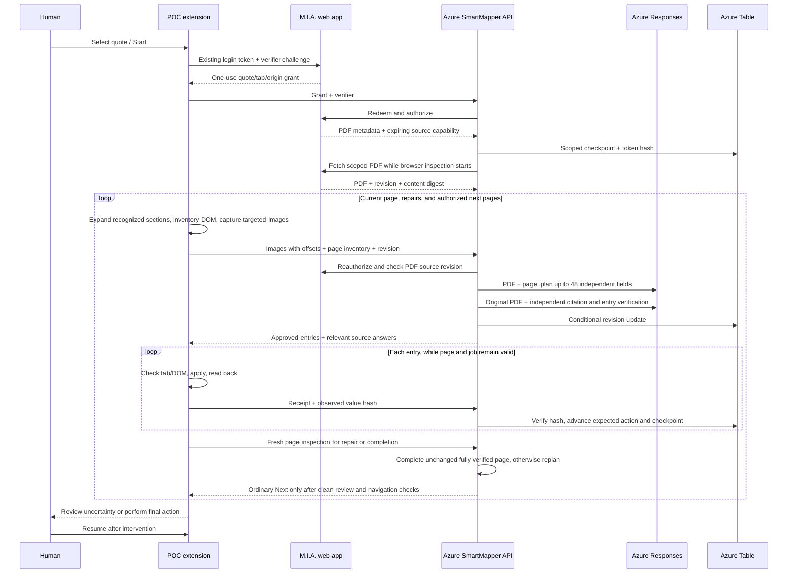

# Architecture

## Active-tab v2 — current implementation

`AiMapperProvider` isolates Azure SDK calls. Shared v2 schemas and policy live in packages; the DOM
observer/executor has no Chrome dependency. Chrome orchestration and trusted session credentials
live in the extension; long-running planning and progress live outside the MV3 worker.

Azure Table ETags and monotonic job revisions prevent concurrent observations, replay and late
responses after Pause. PDFs, raw answer bundles, screenshots and action values are transient; checkpoints
hold scope, counters, hashes, bounded provenance events and an expiring source capability.
Every observation/chat rechecks M.I.A. authorization and revision before using a cached PDF.
The cache holds at most 20 PDFs for five minutes or grant expiry, with cancellation eviction.
No caller-supplied URL can redirect a source token.
ADR 0010 batches model work for independent fields; ordered browser execution and receipts remain
per field. The remainder is invalidated when the page changes, read-back fails or the user pauses.
ADR 0011 reduces provider message overhead with request-local source aliases and compact typed
actions. The provider restores original source IDs and the full versioned action contract before
server policy evaluation. Both independent visual verification and per-field browser checks remain.

ADR 0012 adds whole-page planning and automatic repair after changed controls. ADR 0013 replaces
the source catalog with PDF input and captures only the viewports needed for visual context.
Independent PDF verification remains separate from the planner; fully verified unchanged pages
can complete without another planning call. Ordinary
Next/Continue is an opt-in backend-generated action after clean page review; the model cannot emit
navigation. The browser rechecks the target, binding and form before clicking, and the extension
confirms a changed page before continuing. Final commitments stay human-only. Native controls and a
narrow custom-widget allowlist are supported. Uninspectable frames/shadow controls and truncated pages require review.
Read `SMARTMAPPER_V2_SETUP.md` for configuration and limitations. The sections below describe the
retained v1 synthetic harness; ADR 0005 supersedes conflicting runtime assumptions.

## System shape

SmartMapper is one policy-controlled mapping system with two executor adapters:

    Approved M.I.A. provider
              |
       normalized contracts
              |
       orchestrator / job state
              |
      carrier adapter + automation core
          /                     \
    ExtensionExecutor      RemoteBrowserExecutor
          |                     |
    active user tab        isolated worker session
          \                     /
        human review and manual final action

The core knows actions, policies, source paths, transformations, comparisons, review items, and state.
It does not know Chrome tabs or Playwright pages. Carrier adapters know page/mapping behavior but not
which executor operates it. Executor implementations know how to inspect and manipulate their browser
surface but cannot add new action types.

## Components

- contracts is the only exchanged/persisted vocabulary and versions external shapes.
- automation-core owns state transitions, policy, confidence, source resolution, transformation,
  normalization, read-back comparison, unresolved collection, safe stops, and Executor interfaces.
- carrier-adapters owns versioned carrier/line identity, allowed origins, fingerprints, mappings,
  repeated rows, conditionals, expected validation, navigation, review, and stop points.
- mia-client hides quote search/retrieval. Bootstrap implements only synthetic memory data.
- ai-mapper hides provider SDKs. Bootstrap implements only deterministic sanitized matching.
- observability recursively redacts sensitive structured keys and likely PII in messages.
- extension-prototype demonstrates localhost detection, selection, controls, status, and persisted
  resumability across content script, service worker, and popup.
- orchestrator-api demonstrates small typed job endpoints over in-memory queue/store interfaces.
- automation-worker demonstrates an isolated Playwright context and controlled action execution.
- mock-carriers provides a modern SPA and classic page-navigation lab.

## Data flow and provenance

1. Validate MiaQuotePayload at ingress.
2. Create QuoteJob containing references, not embedded client data.
3. Capture CarrierPageSnapshot with semantics and no control values.
4. Recognize PageFingerprint through an approved adapter and origin.
5. Build FieldMappingCandidate from deterministic evidence; use sanitized AI fallback only if needed.
6. Gate confidence/risk and schema validate AutomationAction.
7. Resolve sourcePath immediately before entry.
8. Execute through an allowlisted method.
9. Read the control value back, normalize, compare, and hash.
10. Store AutomationActionResult, AuditEvent, and any ReviewItem.
11. Persist state/checkpoint and continue or stop.

## Trust boundaries

Carrier DOM is hostile input. Its text cannot modify policy or instruct the AI. AI input/output is
untrusted. Extension/worker permissions are allowlisted. Backend access must be tenant/user scoped.
Remote session artifacts are a separate encrypted, expiring security boundary. Notifications and
handoffs carry short-lived references, not payloads.

## Execution adapters

ExtensionExecutor will translate controlled actions to content-script operations and persist
checkpoints outside service-worker memory. RemoteBrowserExecutor translates the same actions to an
isolated browser API. Neither may accept an arbitrary script callback or arbitrary URL. Persistent
interactive hosting is represented by InteractiveSessionProvider so a container, VM, or desktop host
can be selected after the remote spike.

## Failure model

Unknown adapter/version/domain/action, changed fingerprint, missing/conflicting data, low confidence,
read-back mismatch, page validation, authentication, legal language, and final controls fail closed.
Recoverable states become waiting_for_user or ready_for_review with reason-coded items. Terminal states
do not resume. Retries must be idempotent and revalidate the page and prior read-back before action.
