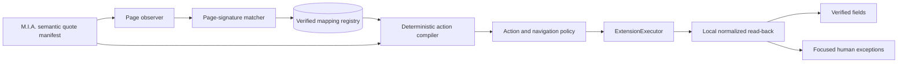
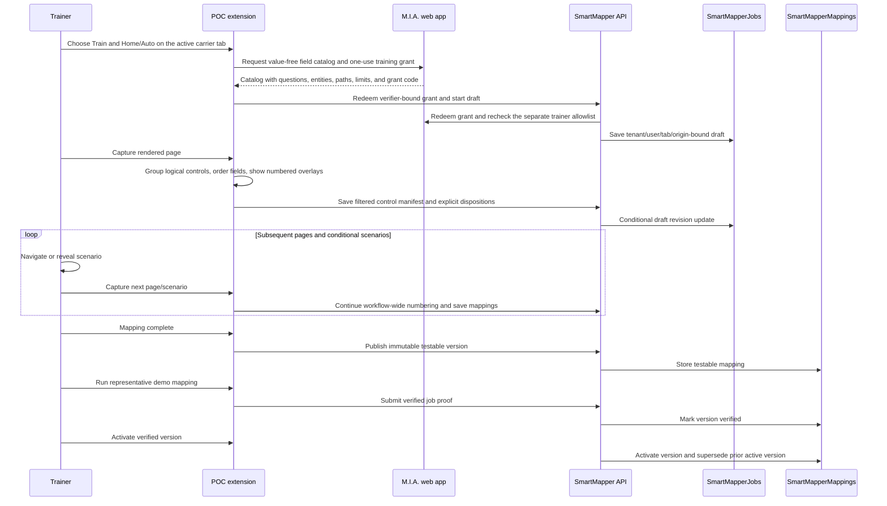
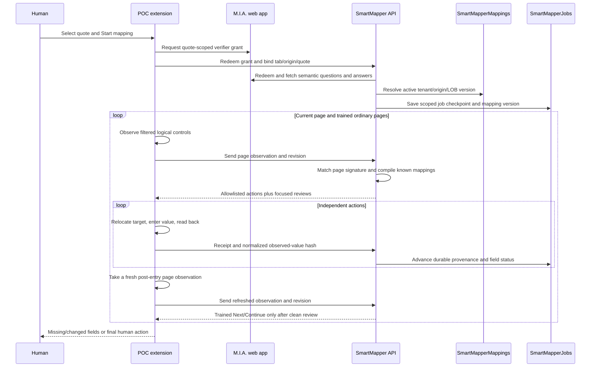

# Architecture

## Active-tab v2 current implementation

[ADR 0018](adr/0018-human-trained-deterministic-mapping-registry.md) is the active POC baseline.
SmartMapper uses a human-trained, versioned mapping registry and deterministic browser execution.
The active runtime makes no Astra, PDF, prompt, chat, suggestion, or model-verification call.

### Training flow

Training is page-by-page. The extension groups controls such as native radio choices into one logical
field, numbers eligible fields in document order, and continues numbering across captured pages and
scenarios. The carrier page gets large linked badges; selecting either a badge or panel row focuses
the other. The trainer supplies one explicit disposition for every field. The backend ignores
trainer-supplied identity names or variants: it uses the tenant, carrier origin, and line of business,
sets the base URL to that origin, and generates `Home workflow` or `Auto workflow` as display text.

The M.I.A. catalog contains definitions rather than quote values. Each entry has the original
question, section, context, data type, stable path/pattern, choices, conditions, and entity. Home
includes both supported applicants. Auto includes all supported fields for the primary applicant,
up to five additional drivers, and up to eight vehicles. Wildcard templates and same-position
bindings express repeated entities without training against one quote's row count.
Approved fixed operational values carry a server-recognized agency/carrier classification and one of
the closed reasons `approved_agency_identifier` or `approved_carrier_identifier`; no free rationale
is persisted.

Drafts live in the existing checkpoint table so they survive extension service-worker restarts.
Publishing creates an immutable `testable` registry version. Verification requires a completed
representative job bound to the same tenant, carrier origin, line of business, and mapping version,
with no failed entries or unresolved review items. Only a `verified` version can become `active`. A
replacement version does not disturb the current active version until it passes those gates.

### Mapping flow

The mapping profile, current page observation, and M.I.A. source manifest are the only inputs to the
action compiler. It resolves semantic source paths to actual values only for their approved target,
applies typed transformations and option crosswalks, and emits the versioned allowlisted
`AutomationActionV2` union. The browser executor never accepts arbitrary JavaScript from a registry
record.

Each action keeps its M.I.A. source IDs, source revision, target signature, transformation, and
expected normalized hash. The content script relocates the current node by semantic identity before
entry, applies the action, reads the current rendered value, normalizes it, and returns a receipt.
A framework rerender or one rejected field does not invalidate successful independent siblings.

Missing mappings, missing M.I.A. answers, changed controls/options, human-required fields,
intentional blanks/defaults, and entry/read-back failures remain distinct outcomes. Required
unresolved fields and carrier validation errors block ordinary Next/Continue. Final Submit, Bind,
Issue, Sell, purchase, payment, consent, attestation, signatures, CAPTCHA, MFA, authentication, and
access-control changes are never registry actions.

## Identity and matching

A workflow's durable identity is exactly the tenant, canonical carrier origin, and Home or Auto line
of business. The base URL is the origin itself. `Home workflow` and `Auto workflow` are generated
display labels, not identity input. Trainer-supplied names and state, product, or program variants do
not create registry scopes.

Page matching uses the route identity and a signature of stable visible structure. Target matching
uses semantic label, section, control kind, options, grouping, occurrence, and repeat position.
Training-time element IDs, DOM nodes, coordinates, display numbers, current values, quote IDs, and
generated framework IDs are not persistent registry identity.

Carrier changes fail closed at the smallest useful boundary. A changed page signature yields a
missing/changed-page review. A changed field or option invalidates only that target. Known fields on
the same page continue when policy permits.

## Components and boundaries

- `contracts` owns the strict exchanged and persisted vocabulary.
- `automation-core` owns registry signatures, source resolution, transformations, policy,
  provenance, normalized comparison, unresolved collection, and executor interfaces.
- `carrier-adapters` remains independent of Chrome and Playwright. Registry data supplies its
  carrier/workflow mappings.
- `mia-client` handles allowlisted M.I.A. origins, one-use verifier grants, field catalogs, and
  quote-source access.
- `extension-prototype` owns active-tab observation, linked overlays, trusted session state, and the
  `ExtensionExecutor` adapter.
- `orchestrator-api` owns authorization, resumable jobs/drafts, registry lifecycle, verification,
  activation, and redacted telemetry.
- `automation-worker` retains the `RemoteBrowserExecutor` for synthetic regression only; it is not
  a current cloud-runtime deliverable.

The core remains one automation system with two executor adapters. Training does not create a second
execution engine, and registry records do not depend on Chrome or Playwright.

## Storage and privacy

`SmartMapperJobs` stores expiring job checkpoints and training drafts. The provisioned
`SmartMapperMappings` table stores versioned mapping metadata. Azure Table ETags and monotonic
revisions reject stale writes and replay. The extension never receives Azure storage credentials.

Raw carrier semantics exist only while the active tab is being observed and rendered for the
trainer. Drafts and published mappings store every carrier-derived label, section, context item,
choice-group string, and option value/label only as a prefixed SHA-256 digest. Published mappings also
contain M.I.A. source patterns, typed transformations, dispositions, lifecycle state, and redacted
audit metadata. They must not contain quote IDs, customer answers, screenshots, HTML, cookies,
tokens, browser storage, credentials, or authenticated profiles. Default logs contain
stage/status/reason codes and hashes, not raw values.

## Trust and failure model

Carrier DOM and M.I.A. payloads are untrusted input and are schema validated. Backend access is bound
to tenant, user, quote or training scope, tab, carrier origin, and expiry. Extension host access uses
the configured service origins plus temporary `activeTab` access for the carrier page.

Unknown workflow/version/page/action, changed signatures, missing or conflicting data, failed
read-back, carrier validation, authentication, legal language, and final controls fail closed.
Recoverable outcomes become reason-coded review items. Retries are idempotent and revalidate the
page and prior receipt. Long-running state remains outside MV3 service-worker lifetime.

The v1 remote-worker flow and historical model-assisted ADRs remain regression evidence. They do not
describe the active 0.3.0 cloud runtime.

The Playwright registry-lifecycle test crosses the real training service, mapping registry,
active-tab service, built extension content executor, and synthetic carrier. It covers publish,
testable proof, verification, activation, active reuse, failed-field continuation, guarded Next, and
the final-submit stop.
